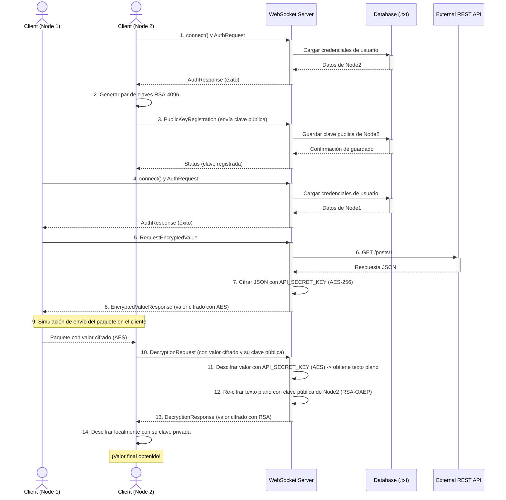

# Sistema de Comunicación Segura con Cifrado Híbrido

Este proyecto demuestra un sistema de comunicación distribuido y seguro entre dos nodos, mediado por un servidor WebSocket. La principal característica es el uso de un esquema de **cifrado híbrido (AES-256 + RSA-4096)** para garantizar la confidencialidad e integridad de los datos transmitidos.

## Descripción General

La aplicación simula un flujo donde un cliente (**Nodo 1**) solicita información sensible de una API externa a través del servidor. El servidor cifra esta información con una clave simétrica (AES) y se la entrega al Nodo 1. Luego, el Nodo 1 "envía" este paquete cifrado al **Nodo 2**. Para que el Nodo 2 pueda leer la información, debe solicitar al servidor que descifre el paquete y se lo vuelva a cifrar usando su propia clave pública (RSA). De esta manera, solo el Nodo 2, poseedor de la clave privada correspondiente, puede acceder al contenido final.

Este sistema está diseñado para cumplir con los siguientes objetivos:
- Establecer comunicación en tiempo real mediante WebSockets.
- Garantizar la autenticación de los nodos mediante usuario y contraseña.
- Implementar un método de encriptación robusto para proteger los datos.
- Demostrar la codificación de paquetes para su transmisión y el proceso de descifrado seguro.

## Características Principales

- **Arquitectura Cliente-Servidor:** Un servidor central en Python gestiona las conexiones, la autenticación y la orquestación del cifrado.
- **Comunicación en Tiempo Real:** Uso de WebSockets para una comunicación bidirecional de baja latencia.
- **Autenticación de Nodos:** Cada cliente debe autenticarse antes de poder realizar operaciones en el sistema.
- **Cifrado Híbrido:**
    - **AES-256-GCM:** Para un cifrado simétrico rápido y seguro de los datos obtenidos de la API.
    - **RSA-4096 (OAEP):** Para el intercambio seguro de la información descifrada, garantizando que solo el destinatario final pueda leerla.
- **Interfaz Web Interactiva:** Un cliente web simple permite visualizar el flujo completo, incluyendo los paquetes codificados y el resultado final.

## Arquitectura y Flujo de Seguridad

El sistema sigue un flujo de seguridad estricto para proteger la información en cada etapa del proceso. El siguiente diagrama ilustra la secuencia de interacciones entre los nodos, el servidor y los componentes externos.


## Stack Tecnológico

- **Backend:** Python
- **Comunicación:** `websockets` (Python library)
- **Criptografía (Backend):** `cryptography` (Python library)
- **Frontend:** HTML5, Tailwind CSS
- **Criptografía (Frontend):** `forge.js`
- **Interfaz:** JavaScript (Vanilla)

## Estructura de Archivos
```
.
|-- server.py             # Servidor principal WebSocket en Python
|-- client.html           # Estructura de la interfaz de usuario
|-- main.js               # Lógica del cliente, manejo de WebSockets y criptografía
|-- database.txt          # Archivo JSON que simula la base de datos de usuarios
|-- sequence.md           # Diagrama de secuencia del flujo de seguridad
+-- README.md             # Este archivo
```

## Instalación y Ejecución

Sigue estos pasos para ejecutar el proyecto en tu máquina local.

### Prerrequisitos

- **Python 3.7+**
- **pip** (manejador de paquetes de Python)

### Instalar dependencias

El servidor necesita algunas librerías de Python. Instálalas usando pip.
```bash
pip install websockets cryptography requests
```

### Iniciar el Servidor
Ejecuta el script del servidor desde tu terminal. El servidor comenzará a escuchar en localhost:8765.

```bash
python server.py

[HH:MM:SS] Servidor listo en ws://localhost:8765
```

### 4. Abre el Cliente

No necesitas un servidor web para el cliente. Simplemente abre el archivo `client.html` directamente en tu navegador web (preferiblemente Chrome o Firefox).

