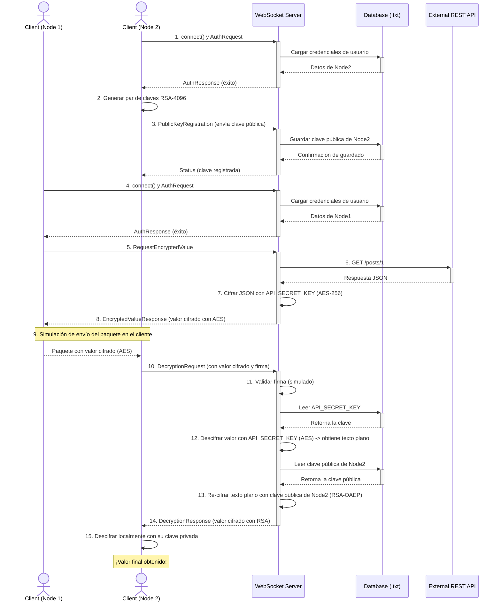

# Security Flow

```mermaid
sequenceDiagram
    actor Node1 as Client (Node 1)
    actor Node2 as Client (Node 2)
    participant Server as WebSocket Server
    participant DB as Database (.txt)
    participant API as External REST API

    %% --- Fase 1: Node 2 se conecta y registra su clave pública ---
    Node2->>+Server: 1. connect() y AuthRequest
    Server->>+DB: Cargar credenciales de usuario
    DB-->>-Server: Datos de Node2
    Server-->>-Node2: AuthResponse (éxito)
    
    Node2->>Node2: 2. Generar par de claves RSA-4096
    Node2->>+Server: 3. PublicKeyRegistration (envía clave pública)
    Server->>+DB: Guardar clave pública de Node2
    DB-->>-Server: Confirmación de guardado
    Server-->>-Node2: Status (clave registrada)

    %% --- Fase 2: Node 1 se conecta y solicita el valor ---
    Node1->>+Server: 4. connect() y AuthRequest
    Server->>+DB: Cargar credenciales de usuario
    DB-->>-Server: Datos de Node1
    Server-->>-Node1: AuthResponse (éxito)

    Node1->>+Server: 5. RequestEncryptedValue
    Server->>+API: 6. GET /posts/1
    API-->>-Server: Respuesta JSON
    Server->>Server: 7. Cifrar JSON con API_SECRET_KEY (AES-256)
    Server-->>-Node1: 8. EncryptedValueResponse (valor cifrado con AES)
    
    %% --- Fase 3: Transferencia y Descifrado ---
    Note over Node1, Node2: 9. Simulación de envío del paquete en el cliente
    Node1-->>Node2: Paquete con valor cifrado (AES)

    Node2->>+Server: 10. DecryptionRequest (con valor cifrado y firma)
    Server->>Server: 11. Validar firma (simulado)
    Server->>+DB: Leer API_SECRET_KEY
    DB-->>-Server: Retorna la clave
    Server->>Server: 12. Descifrar valor con API_SECRET_KEY (AES) -> obtiene texto plano
    
    Server->>+DB: Leer clave pública de Node2
    DB-->>-Server: Retorna la clave pública
    Server->>Server: 13. Re-cifrar texto plano con clave pública de Node2 (RSA-OAEP)
    Server-->>-Node2: 14. DecryptionResponse (valor cifrado con RSA)

    Node2->>Node2: 15. Descifrar localmente con su clave privada
    Note over Node2: ¡Valor final obtenido!
```